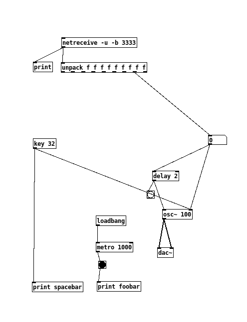

# houdini to pure data over a TCP conection

a small program that, when ran, opens up a interactive puredata instance in the background. This instance can respond to incoming tcp connections. this can come from different sources.

the following command opens pureDate (pd) without a gui, and with a message ```; pd dsp 1 ``` that sets the dsp (sound) to 1 (on)


```shell
pd -nogui  -send "; pd dsp 1" ~/Downloads/patch_terminal.pd

```


## basic TCP connection setup in puredata




## sending TCP data from houdini 

the following code constructs a socket, and send an houdini attribute over that socket.

this is the 

```python
node = hou.pwd()
geo = node.geometry()

import socket
import time

UDP_IP = "127.0.0.1"
UDP_PORT = 3333

#print("UDP target IP: %s" % UDP_IP)
#print("UDP target port: %s" % UDP_PORT)
#print(hou.evalParm("slider"))

sock = socket.socket(socket.AF_INET, socket.SOCK_DGRAM)

point = geo.iterPoints()[0]
pos = point.attribValue("P")
data = pos[0]*100 #get x value
data = int(data)

sock.sendto(data.to_bytes(8, byteorder='big'), (UDP_IP, UDP_PORT))
# print("Sent: ", d)
   ```

The code is quite straifntforward, however, making houdini pyhtin respond "live" requires a trick. 

- make a slider , and put in ```hou.frame()```. when pressing 'PLAY' the python sop cn be anaylized live.

## what could be cool in the future
### ideas
- houdini to puredata
- puredata to houdini
- mousekeys listener to puredata


### workflow
little shell script where i can choose the function and song

e.g. ```soundbox -m keystrokelistner -s ambient_1 ```

where soundbox is an alias for the shell script ```soundbox.sh```
- -m would be the mode e.g. "keystrokelistener"
- -s would be the song file i puredata. e.g "ambient_1 " --> $SOUNDBOX_ENV/files/ambient_1


 
        

